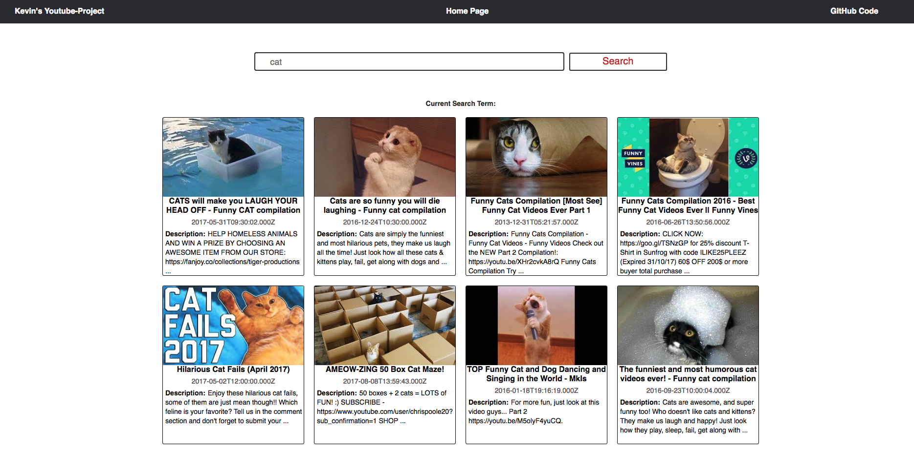
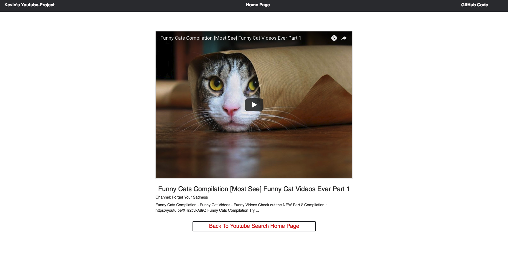
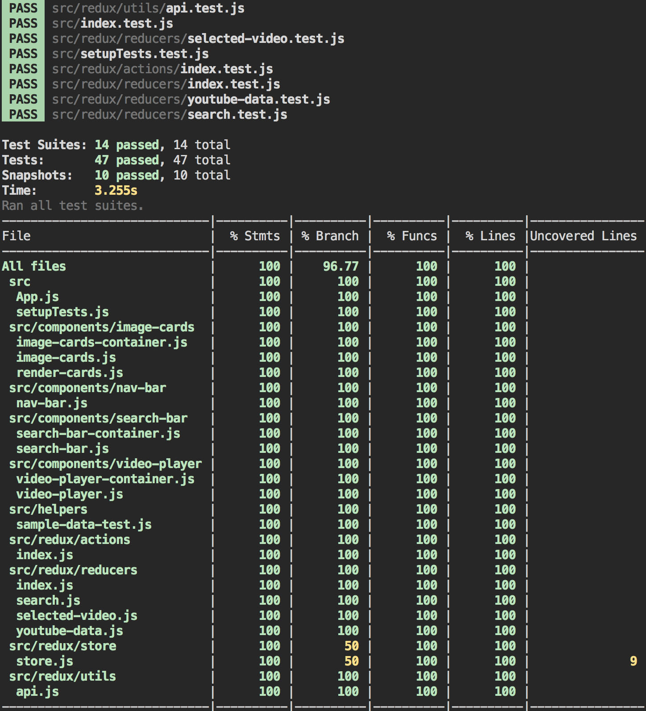
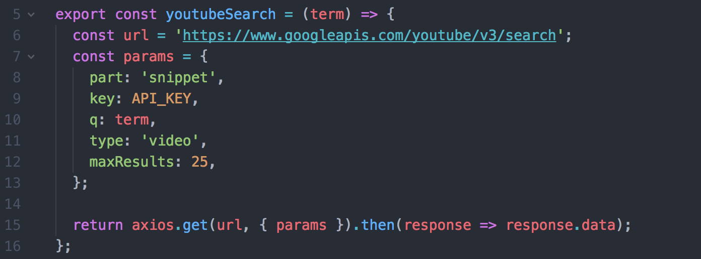
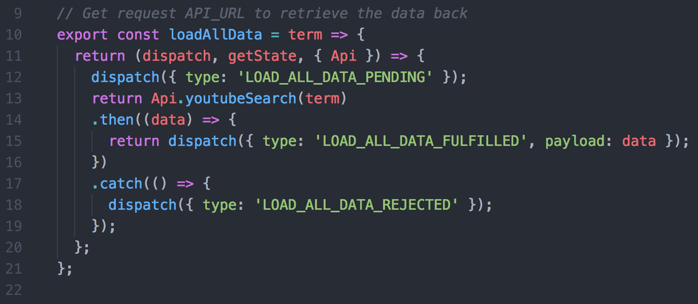

# Youtube App #

This is a simple React/Redux application that let you search youtube videos.

## Features Of This App: ##
- The app let you search for a list of 25 youtube videos
- You can click on one of those videos to watch it
- After you click on the one of videos, you will get redirect to another page
- The app has tests verifying it's functionality

Screenshot:

Home Page


Video Page


## To Start App ##
To utilize this repo, please do the following:

1. Fork & clone this repository
2. Do an NPM install inside your terminal to obtain necessary node modules: `npm install`
3. To run this app locally, run `npm start` inside your terminal to start up a development server with which you can preview your work at any given time.

## Testing ##
I screenshotted the testing coverage:

**Test Coverage Details:**

- Test coverage for components is **100%**
- Test coverage for reducers is **100%**
- Test coverage for actions is **100%**
- Test coverage for utils/api is **100%**

**NOTE: To view the tests, cd into the root directory run the following command**

1. run ```npm test``` to run all the tests without the test coverage interface
2. run ```npm test -- --coverage``` to run all the files with the test coverage interface
3. run ```open coverage/lcov-report/index.html ``` to view a report of the coverage files
4. run ```npm test -- --coverage --coveragePathIgnorePatterns src/index.js``` to run all the tests without the index.js. we don't need to test React Dom Render and the store since they were tested by the creators);




## Technologies Used

The app is currently built with Javascript, React and Redux.
Other pieces of technologies include:

* [Redux-Thunk](https://github.com/gaearon/redux-thunk)(A middleware allows you to write action creators that return a function instead of an action)

I used redux-thunk-middleware to ensure the flow of actions.

## Redux Store
You can see that the actions take in an api Object(src/utils/api.js directory). The app is fully tested and functional. I utilized the extraArgument parameter inside the Thunk-Middleware and set the util/api.js object(api network requests) as the extraArgument. This structure let me test actions, Apis, thunks, and components separately. This methodology allows me to maintain the idea of separation of concerns.


```Javascript
const store = createStore(reducer,
  window.__REDUX_DEVTOOLS_EXTENSION__ && window.__REDUX_DEVTOOLS_EXTENSION__(),
  applyMiddleware(thunkMiddleware.withExtraArgument({ Api }), promiseMiddleware()),
);
```

This is my api object. Notice that my api's role only make network request. api doesn't do any logic of fetching data or manipulating data



This is what my thunk with extra argument looks like. I use my thunk to create three stages: PENDING, FULFULLED, and REJECTED



I hope you had a good time when reviewing this app. I am always open to any feedback.
